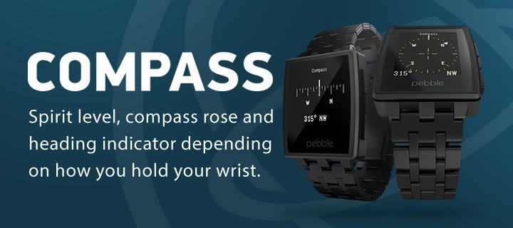

# Pebble Compass

Shows a white compass rose on black background, a level indicator and two text layers showing the current heading angle in degrees and as short direction text, e.g. "N" or "NE".
It smoothly transitions to a second representation as band if you hold your watch upright.
Also, the compass value fakes a physical model with friction and inertia.

## Components

- `data_provider.{h,c}`
	- offers various callbacks to combine accelerometer, compass data, orientation changes and other meaningful events
	- not used in this app: callbacks to modify the calculated value, head to a different angle but 0º, etc.
		
- `compass_window.{h,c}`
	- main window that mediates between the data provider and the various layers,
	- Mananges a transition state between "rose" and "band" to layout its various sub layers
	- presents and dismisses the calibration window according to `data_provider_compass_needs_calibration()`
	
- `compass_calibration_window.{h,c}`	
	- window to encourage the user to perform movements that will help the compass to calibrate
	- has no real knowledge over the compass calibration
	- has a super simple API and should be shared with other developers to do calibration
	
- `ticks_layer.{h,c}`, renders the actual compass rose/band
- `inverted_cross_hair_layer.{h,c}`, needed to draw the cross-hair with public API (this is sad, see comments in the code)
	
## Remarks

There are a few TODOs in the code base. It's mostly about the usage of floats where one could use ints instead to save code space. Also, the ongoing animations of this app (and the missing exit condition in `data_provider.c`) have a strong impact on the battery life. Please read the comments if you consider using `data_provider.{h,c}` in your projects.